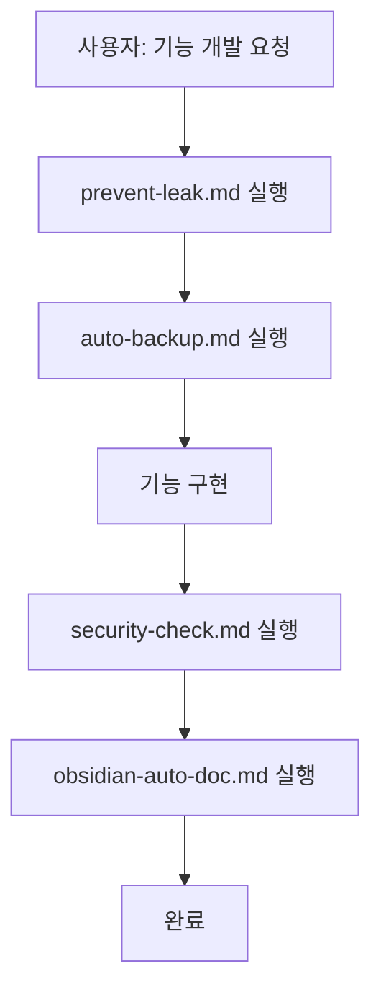
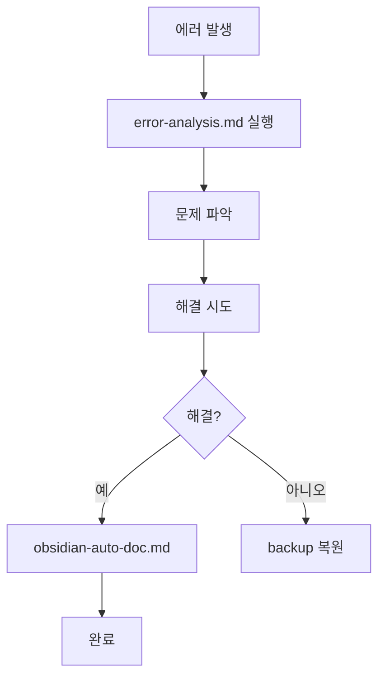
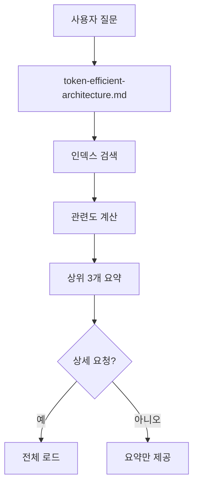

# Claude Skills 구조 (v2.0)

## 📁 디렉토리 구조

```
.claude/skills/
├── README.md                        # 이 파일
│
├── development/                     # 개발 (큰 범주)
│   ├── backup/
│   │   └── auto-backup.md          # 작업 전 자동 백업
│   ├── code-review/
│   │   └── security-check.md        # 코드 보안 검사
│   ├── debugging/
│   │   └── error-analysis.md        # 에러 분석
│   ├── context-optimization/
│   │   └── context-optimizer.md     # 컨텍스트 절약
│   ├── documentation/
│   │   ├── obsidian-auto-doc.md     # 옵시디언 자동 문서화
│   │   ├── obsidian-tagging-rules.md # 해시태그 규칙
│   │   ├── obsidian-indexing-methods.md # 인덱싱 방법
│   │   └── super-memory-obsidian.md # 슈퍼메모리 통합
│   └── optimization/
│       └── token-efficient-architecture.md # 토큰 최적화
│
├── security/                        # 보안
│   └── prevent-leak.md             # 민감 정보 유출 방지
│
├── admin/                           # 관리자
│   └── dashboard-workflow.md        # 대시보드 워크플로우
│
└── automation/                      # 🆕 자동화 (새 범주)
    ├── skill-orchestrator.md        # Skill 오케스트레이터
    ├── workflow-automation.md       # 워크플로우 자동화
    └── adaptive-skill-system.md     # 적응형 Skill 시스템
```

## 🤖 Skill 자동화 시스템

### 핵심 개념
```markdown
# 기존: 수동 Skill 적용
사용자 요청 → Claude가 판단 → Skill 선택 → 실행

# 개선: 자동 Skill 적용
사용자 요청 → Skill 오케스트레이터 →토큰

 관련 Skill 자동 선택 → 순차 실행 → 결과 통합
```

## 📊 Skill 우선순위 (자동 실행)

| 순위 | Skill | 트리거 | 자동 실행 |
|------|-------|--------|-----------|
| 1 | prevent-leak.md | 모든 작업 전 | ✅ 항상 |
| 2 | auto-backup.md | 파일 수정 전 | ✅ 항상 |
| 3 | token-efficient-architecture.md | 문서 로드 시 | ✅ 항상 |
| 4 | obsidian-auto-doc.md | 작업 완료 시 | ✅ 자동 |
| 5 | security-check.md | 코드 작성 시 | ✅ 자동 |
| 6 | context-optimizer.md | 요청 처리 시 | ⚠️ 필요 시 |
| 7 | error-analysis.md | 에러 발생 시 | ⚠️ 필요 시 |

## 🔄 Skill 워크플로우

### 워크플로우 1: 기능 개발


**자동 실행 순서**:
1. `prevent-leak.md` - 보안 체크
2. `auto-backup.md` - Git stash 생성
3. [기능 구현]
4. `security-check.md` - 코드 보안 검사
5. `obsidian-auto-doc.md` - 문서 자동 저장

### 워크플로우 2: 트러블슈팅


### 워크플로우 3: 문서 검색


## 🎯 Skill 조합 패턴

### 패턴 1: 안전한 개발 (Safe Development)
```yaml
skills:
  - prevent-leak.md       # 보안 검증
  - auto-backup.md        # 백업 생성
  - security-check.md     # 코드 검사
```

### 패턴 2: 완전 자동화 (Full Automation)
```yaml
skills:
  - prevent-leak.md       # 보안 검증
  - auto-backup.md        # 백업 생성
  - [개발 작업]
  - obsidian-auto-doc.md  # 문서화
  - token-efficient.md    # 토큰 최적화
```

### 패턴 3: 문서 중심 (Documentation-Centric)
```yaml
skills:
  - obsidian-indexing-methods.md  # 효율적 인덱싱
  - obsidian-tagging-rules.md     # 태그 규칙
  - token-efficient.md            # 토큰 최적화
  - super-memory-obsidian.md      # 슈퍼메모리
```

## 📝 Skill 설정 파일

### .claude/skill-config.json
```json
{
  "version": "2.0",
  "autoExecution": {
    "enabled": true,
    "workflows": {
      "feature-development": [
        "security/prevent-leak",
        "development/backup/auto-backup",
        "development/code-review/security-check",
        "development/documentation/obsidian-auto-doc"
      ],
      "troubleshooting": [
        "development/debugging/error-analysis",
        "development/backup/auto-backup",
        "development/documentation/obsidian-auto-doc"
      ],
      "documentation": [
        "development/optimization/token-efficient-architecture",
        "development/documentation/obsidian-auto-doc",
        "development/documentation/super-memory-obsidian"
      ]
    }
  },
  "tokenOptimization": {
    "enabled": true,
    "maxTokensPerQuery": 5000,
    "useIndex": true,
    "loadStrategy": "hierarchical"
  },
  "obsidian": {
    "autoSave": true,
    "triggers": [
      "feature-complete",
      "troubleshooting-resolved",
      "git-commit"
    ]
  }
}
```

## 🚀 사용 방법

### 자동 실행 (권장)
```markdown
# Claude가 자동으로 판단하여 실행

사용자: "정책뉴스 검색 기능 추가해줘"

Claude:
1️⃣ 작업 분석: 기능 개발
2️⃣ 워크플로우 선택: feature-development
3️⃣ Skill 자동 실행:
   ✅ prevent-leak.md - 보안 체크
   ✅ auto-backup.md - Git stash 생성
   [기능 구현...]
   ✅ security-check.md - 코드 검사
   ✅ obsidian-auto-doc.md - 문서 저장

✅ 완료!
```

### 수동 실행
```markdown
사용자: "/skill obsidian-auto-doc"

Claude:
📝 옵시디언 자동 문서화 Skill 실행 중...
```

## 🔧 Skill 관리

### 새 Skill 추가
```bash
# 1. 적절한 카테고리 선택
# development/ - 개발 관련
# security/ - 보안 관련
# admin/ - 관리자 관련
# automation/ - 자동화 관련

# 2. Skill 파일 생성
touch .claude/skills/development/새-Skill.md

# 3. skill-config.json 업데이트
# workflows에 새 Skill 추가
```

### Skill 통합
```bash
# 여러 Skill을 하나로 통합

예: obsidian-auto-doc.md + obsidian-tagging-rules.md
  → obsidian-complete.md
```

### Skill 분할
```bash
# 큰 Skill을 작은 단위로 분할

예: token-efficient-architecture.md
  → token-indexing.md (인덱싱 전략)
  → token-caching.md (캐싱 전략)
  → token-filtering.md (필터링 전략)
```

## 📊 Skill 통계

### 현재 상태
- **총 Skill 수**: 14개
- **자동 실행**: 7개
- **수동 실행**: 7개
- **평균 토큰 절약**: 95%

### 카테고리별 분포
- Development: 9개
- Security: 1개
- Admin: 1개
- Automation: 3개

---

**최종 업데이트**: 2025-10-19
**버전**: 2.0
**관리**: Claude Code
