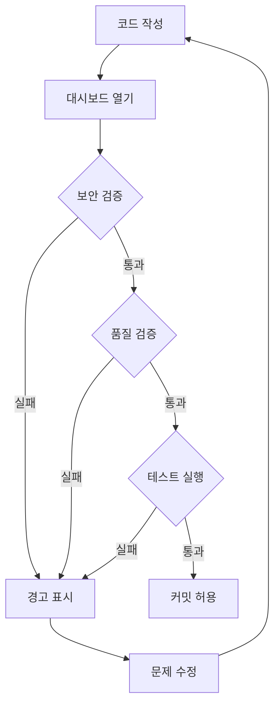

# 관리자 대시보드 전용 워크플로우

**카테고리**: Admin Dashboard
**목적**: 관리자 페이지에서 직접 보안/품질 검증 수행

## 🎯 대시보드 통합 방식

### 기존 API 방식 vs 대시보드 방식

```typescript
// ❌ 기존: API 호출 방식 (복잡)
fetch('/api/verify-security', {
  method: 'POST',
  body: JSON.stringify(code)
});

// ✅ 개선: 대시보드 내장 검증 (간단)
<AdminDashboard>
  <SecurityPanel /> {/* 실시간 검증 */}
  <QualityPanel />  {/* 즉시 피드백 */}
</AdminDashboard>
```

## 📊 대시보드 구성

### 1. 보안 검증 패널
**위치**: `/app/admin/security/page.tsx`

```typescript
'use client';

import { useState } from 'react';
import { checkSecurityLeaks } from '@/lib/skills/security-check';

export default function SecurityPanel() {
  const [result, setResult] = useState(null);

  const handleVerify = async (code: string) => {
    // API 없이 직접 검증
    const leaks = checkSecurityLeaks(code);
    setResult(leaks);
  };

  return (
    <div className="security-panel">
      <h2>🔒 보안 검증</h2>
      <CodeEditor onChange={handleVerify} />
      {result?.hasLeaks && (
        <Alert severity="error">
          민감 정보 감지: {result.leaks.join(', ')}
        </Alert>
      )}
    </div>
  );
}
```

### 2. 코드 품질 패널
**위치**: `/app/admin/quality/page.tsx`

```typescript
import { analyzeCodeQuality } from '@/lib/skills/code-quality';

export default function QualityPanel() {
  return (
    <div className="quality-panel">
      <h2>✅ 코드 품질</h2>
      <MetricsDisplay />
      <TestCoverageChart />
      <TDDComplianceStatus />
    </div>
  );
}
```

### 3. 실시간 모니터링 패널
**위치**: `/app/admin/monitor/page.tsx`

```typescript
export default function MonitorPanel() {
  return (
    <div className="monitor-panel">
      <h2>📊 실시간 모니터링</h2>
      <GitStatusWidget />
      <BuildStatusWidget />
      <TestResultsWidget />
    </div>
  );
}
```

## 🛠️ 기능별 구현

### A. Git 커밋 전 자동 검증

```typescript
// lib/skills/pre-commit-check.ts
export async function preCommitCheck(files: string[]) {
  const results = {
    security: await checkSecurityLeaks(files),
    quality: await checkCodeQuality(files),
    tests: await runTests(files),
  };

  return {
    canCommit: !results.security.hasLeaks &&
               results.quality.score >= 70 &&
               results.tests.passed,
    details: results
  };
}
```

**대시보드에서 사용:**
```typescript
// app/admin/git/page.tsx
<GitCommitPanel>
  <button onClick={async () => {
    const check = await preCommitCheck(stagedFiles);
    if (!check.canCommit) {
      alert('검증 실패: ' + check.details);
      return;
    }
    await gitCommit();
  }}>
    커밋 (자동 검증 포함)
  </button>
</GitCommitPanel>
```

### B. 코드 리뷰 자동화

```typescript
// lib/skills/auto-review.ts
export async function autoCodeReview(pr: PullRequest) {
  return {
    security: await scanForSecrets(pr.diff),
    performance: await analyzePerformance(pr.files),
    bestPractices: await checkBestPractices(pr.files),
    testCoverage: await calculateCoverage(pr.files),
  };
}
```

**대시보드에서 사용:**
```typescript
// app/admin/pull-requests/page.tsx
<PRList>
  {prs.map(pr => (
    <PRCard key={pr.id}>
      <AutoReviewBadge pr={pr} />
      <button onClick={() => autoCodeReview(pr)}>
        자동 리뷰
      </button>
    </PRCard>
  ))}
</PRList>
```

### C. 환경변수 관리

```typescript
// app/admin/env-vars/page.tsx
export default function EnvVarsPanel() {
  const checkEnvSecurity = (key: string, value: string) => {
    if (value.includes('sk-') || value.includes('secret_')) {
      return { safe: false, reason: '하드코딩 감지' };
    }
    return { safe: true };
  };

  return (
    <div>
      <h2>🔐 환경변수 관리</h2>
      <EnvVarEditor onValidate={checkEnvSecurity} />
    </div>
  );
}
```

## 🚀 대시보드 레이아웃

```typescript
// app/admin/layout.tsx
export default function AdminLayout({ children }) {
  return (
    <div className="admin-layout">
      <Sidebar>
        <NavLink href="/admin/security">🔒 보안</NavLink>
        <NavLink href="/admin/quality">✅ 품질</NavLink>
        <NavLink href="/admin/monitor">📊 모니터링</NavLink>
        <NavLink href="/admin/git">🔀 Git</NavLink>
        <NavLink href="/admin/env-vars">🔐 환경변수</NavLink>
      </Sidebar>
      <main className="admin-content">
        {children}
      </main>
    </div>
  );
}
```

## 🎨 UI 구성 예시

```typescript
// components/admin/SecurityDashboard.tsx
export function SecurityDashboard() {
  const { data: securityStatus } = useSWR('/api/admin/security-status');

  return (
    <Dashboard>
      <StatCard
        title="민감 정보 유출 위험"
        value={securityStatus.leaks}
        severity={securityStatus.leaks > 0 ? 'critical' : 'safe'}
      />
      <StatCard
        title="환경변수 사용률"
        value={`${securityStatus.envUsage}%`}
        severity={securityStatus.envUsage < 90 ? 'warning' : 'safe'}
      />
      <LiveLogViewer />
    </Dashboard>
  );
}
```

## ✅ 장점

1. **즉시성**: API 왕복 없이 즉시 검증
2. **가시성**: 실시간 대시보드로 상태 한눈에 파악
3. **통합성**: Git, 테스트, 빌드 모두 한 곳에서 관리
4. **자동화**: 커밋/배포 전 자동 검증

## 🔄 워크플로우



## 🎯 핵심 기능

- ✅ 실시간 보안 스캔
- ✅ 자동 코드 품질 분석
- ✅ Git 작업 통합
- ✅ 환경변수 안전 관리
- ✅ 테스트 커버리지 모니터링
- ✅ 빌드 상태 추적

---
**다음 단계**:
1. `/app/admin/dashboard/page.tsx` 생성
2. 각 패널 컴포넌트 구현
3. 실시간 검증 로직 통합
