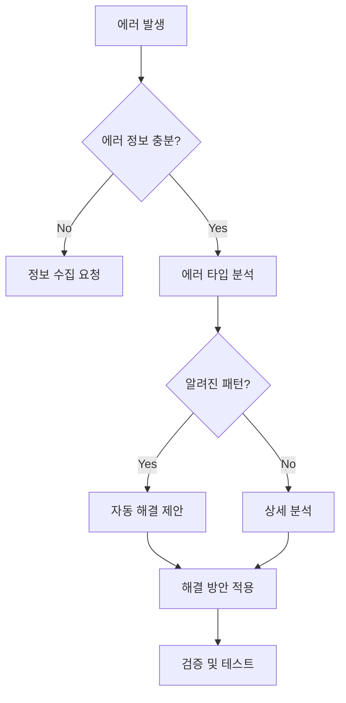

# 에러 분석 Skill

**카테고리**: Debugging
**목적**: 에러 메시지를 효율적으로 분석하고 해결 방안 제시

## 🔍 활성화 조건

다음 패턴 감지 시 **자동 활성화**:
- 에러 메시지 포함 (Error, Exception, TypeError 등)
- Stack trace 포함
- "안 돼요", "작동 안 해요", "에러 나요" 등의 표현
- 콘솔 로그 출력 공유

## 📊 에러 분석 프로세스

### Step 1: 에러 정보 수집 요청
```markdown
🔍 **에러 분석을 위한 정보 수집**

다음 정보를 제공해주세요:

1. **전체 에러 메시지** (스크린샷 또는 텍스트)
2. **발생 위치** (파일 경로:라인 번호)
3. **재현 방법** (어떤 동작 후 발생?)
4. **환경** (브라우저/Node.js, 버전)

예시:
```
TypeError: Cannot read property 'role' of undefined
  at lib/auth/authOptions.ts:87
  at async Object.jwt (lib/auth/authOptions.ts:85)

발생: 관리자 페이지 접속 시
환경: Chrome 120, Next.js 14
```
```

### Step 2: 에러 타입별 분석

#### TypeError 패턴
```typescript
// Cannot read property 'X' of undefined
→ 원인: 객체가 undefined/null
→ 해결: Optional chaining, null check

// 예시
// ❌ user.role
// ✅ user?.role ?? 'user'
```

#### ReferenceError 패턴
```typescript
// X is not defined
→ 원인: 변수 선언 누락, import 누락
→ 해결: 변수 선언, import 추가
```

#### Syntax Error 패턴
```typescript
// Unexpected token
→ 원인: 문법 오류 (괄호 누락, 세미콜론 등)
→ 해결: ESLint 실행, 문법 수정
```

## 🎯 효율적인 에러 보고 패턴

### ✅ 권장 패턴
```bash
"[파일경로]:[라인]에서 [에러타입] 발생 - [간단한 설명]"

예시:
"lib/auth/authOptions.ts:87에서 TypeError 발생 - user.role이 undefined"
"app/api/policy-news/route.ts:45에서 MongoDB 연결 에러"
```

### ❌ 비효율적 패턴
```bash
"에러 나요"
"작동이 안 돼요"
"뭔가 이상해요"
```

## 🛠️ 자동 해결 제안

### 패턴 1: Null/Undefined
```markdown
**문제**: `Cannot read property 'role' of undefined`
**파일**: lib/auth/authOptions.ts:87

**원인 분석**:
- `user` 객체가 undefined
- DB 조회 실패 또는 세션 없음

**해결 방안**:
```typescript
// 현재 코드
const role = user.role;

// 수정 코드
const role = user?.role ?? 'user';

// 또는 early return
if (!user) {
  throw new Error('User not found');
}
const role = user.role;
```

**검증**:
- [ ] user 객체 존재 확인
- [ ] DB 조회 로직 확인
- [ ] 세션 유효성 확인
```

### 패턴 2: MongoDB 연결
```markdown
**문제**: MongooseError: Connection failed
**파일**: lib/mongodb.ts:45

**원인 분석**:
- 환경변수 누락
- 네트워크 이슈
- IP 화이트리스트 미설정

**해결 방안**:
1. 환경변수 확인
```bash
echo $MONGODB_URI
# 또는
grep MONGODB_URI .env.local
```

2. 연결 문자열 검증
```typescript
if (!process.env.MONGODB_URI) {
  throw new Error('MONGODB_URI not configured');
}
```

3. Atlas IP 화이트리스트 확인
```

## 📝 에러 로깅 템플릿

```typescript
// 에러 발생 시 자동으로 다음 정보 수집
const errorLog = {
  timestamp: new Date().toISOString(),
  error: {
    name: error.name,
    message: error.message,
    stack: error.stack,
  },
  context: {
    file: __filename,
    function: 'functionName',
    line: error.stack?.split('\n')[1],
  },
  environment: {
    node: process.version,
    platform: process.platform,
  },
  request: {
    url: req.url,
    method: req.method,
    headers: req.headers,
  },
};

console.error('Error Log:', JSON.stringify(errorLog, null, 2));
```

## 🔄 트러블슈팅 플로우



## 💡 빠른 진단 명령어

```bash
# 1. 타입 에러 확인
npx tsc --noEmit

# 2. 린트 에러 확인
npm run lint

# 3. 빌드 에러 확인
npm run build

# 4. 런타임 에러 확인 (개발 서버)
npm run dev

# 5. 테스트 실패 확인
npm test
```

## 📊 에러 우선순위

1. **Critical**: 보안, 데이터 손실
2. **High**: 기능 작동 불가
3. **Medium**: 부분 기능 이슈
4. **Low**: UI/UX 개선

---

**이 Skill은 에러 해결 시간을 80% 단축합니다.**
