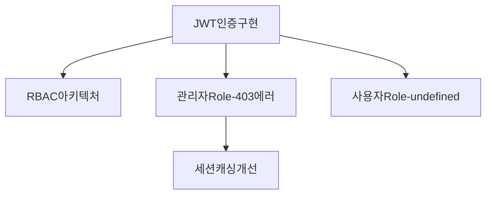

# 옵시디언 효과적인 인덱싱 방법

**카테고리**: Development - Documentation
**목적**: 다층적 인덱싱으로 Claude가 복잡하지 않게 지식을 찾을 수 있도록

## 🎯 옵시디언 6가지 인덱싱 방법

### 1. 해시태그 (#tags)
```markdown
# 장점: 빠른 분류, 필터링
# 단점: 계층 구조 표현 제한

#나라똔 #인증 #트러블슈팅 #해결완료
```

### 2. 중첩 태그 (Nested Tags)
```markdown
# 계층적 분류 가능

#프로젝트/나라똔
#프로젝트/집첵

#기능/인증/JWT
#기능/인증/OAuth
#기능/파일관리/이미지업로드

#상태/진행중
#상태/완료
#상태/보류
```

**Claude 검색 시**:
- `#기능/인증` → JWT, OAuth 모두 검색
- `#기능/인증/JWT` → JWT만 검색

### 3. 인라인 메타데이터 (Inline Metadata)
```markdown
# 문서 본문 어디서나 사용 가능

프로젝트:: 나라똔
상태:: 완료
심각도:: High
담당자:: Claude
소요시간:: 2시간
관련기능:: 인증, 관리자
```

**Dataview 쿼리**:
```markdown
```dataview
TABLE 상태, 심각도, 소요시간
WHERE 프로젝트 = "나라똔" AND 상태 = "완료"
SORT 심각도 DESC
```
```

### 4. YAML Front Matter (메타데이터 블록)
```markdown
---
프로젝트: 나라똔
카테고리: 트러블슈팅
발생기능: 관리자인증
에러타입: 403에러
심각도: High
해결여부: 해결완료
소요시간: 2h
관련파일:
  - lib/auth/authOptions.ts
  - app/admin/layout.tsx
관련API:
  - /api/auth/session
태그:
  - 나라똘
  - 인증
  - 관리자
  - 트러블슈팅
---
```

**고급 쿼리**:
```markdown
```dataview
TABLE 발생기능, 에러타입, 소요시간
WHERE 프로젝트 = "나라똔"
  AND 심각도 = "High"
  AND 해결여부 = "해결완료"
SORT 날짜 DESC
```
```

### 5. 양방향 링크 (Bidirectional Links)
```markdown
# 문서 간 자동 연결

## 트러블슈팅 문서
관련 기능: [[2025-10-20-심사관관리기능]]
관련 아키텍처: [[2025-09-10-RBAC아키텍처]]
참고 문서: [[2025-09-15-JWT인증구현]]

→ 옵시디언이 자동으로 역링크 생성
→ "심사관관리기능" 문서에서 "이 문서를 참조한 문서" 섹션에 자동 표시
```

### 6. MOC (Map of Content) + Dataview
```markdown
# 동적 인덱스 (자동 업데이트)

## 나라똔 - 트러블슈팅 인덱스

### 미해결 문제
```dataview
TABLE 발생기능 as "기능", 에러타입 as "에러", 심각도
FROM #나라똔 AND #트러블슈팅
WHERE 해결여부 = "진행중"
SORT 심각도 DESC, 날짜 ASC
```

### 최근 해결 (7일 이내)
```dataview
TABLE 발생기능, 소요시간
FROM #나라똔 AND #트러블슈팅
WHERE 해결여부 = "해결완료"
  AND 날짜 >= date(today) - dur(7 days)
SORT 날짜 DESC
```

### 심각도별 통계
```dataview
TABLE length(rows) as "개수"
FROM #나라똔 AND #트러블슈팅
GROUP BY 심각도
SORT 심각도 DESC
```
```

## 🏗️ 추천 인덱싱 구조 (다층 접근)

### Layer 1: 폴더 구조 (물리적 분류)
```
Projects/나라똔/
├── 00-기획/
├── 01-아키텍처/
├── 02-스키마/
├── 03-기능개발/
├── 04-보안/
├── 05-트러블슈팅/
├── 98-결정사항/
└── 99-대화기록/
```

**Claude 검색**:
```markdown
파일 경로로 검색: path:"Projects/나라똔/05-트러블슈팅"
```

### Layer 2: 중첩 태그 (논리적 분류)
```markdown
---
tags:
  - 프로젝트/나라똔
  - 기능/인증/JWT
  - 작업유형/트러블슈팅/버그픽스
  - 상태/완료
  - 심각도/High
---
```

**Claude 검색**:
```markdown
# 계층별 검색
tag:#기능/인증           → 인증 관련 모두
tag:#기능/인증/JWT       → JWT만
tag:#작업유형/트러블슈팅  → 모든 트러블슈팅
tag:#심각도/High         → 심각도 높은 것만
```

### Layer 3: 메타데이터 (상세 속성)
```markdown
---
발생일시: 2025-10-19T14:30:00
해결일시: 2025-10-19T16:45:00
소요시간: 2h15m
발생환경: production
영향범위: 관리자 전체
관련담당자: [백경우, Claude]
---
```

**Claude 고급 쿼리**:
```markdown
```dataview
TABLE 소요시간, 영향범위
WHERE 발생환경 = "production"
  AND 소요시간 > dur(2 hours)
```
```

### Layer 4: 인라인 메타데이터 (동적 속성)
```markdown
# 문서 본문 중간에 추가 정보

## 해결 과정

첫 번째 시도:: sed로 환경변수 교체 → 실패 (이유:: 특수문자 이스케이프 문제)
두 번째 시도:: printf 사용 → 성공 (소요시간:: 30분)

최종 해결 방법::
- vercel env rm 후 재설정
- 줄바꿈 제거: echo -n
```

**Claude 검색**:
```markdown
```dataview
LIST
WHERE contains(첫시도, "실패")
```
```

### Layer 5: 양방향 링크 (관계 그래프)
```markdown
# 관련 문서 자동 연결

관련 기능:: [[심사관관리기능]]
선행 작업:: [[RBAC아키텍처]]
후속 작업:: [[관리자세션캐싱]]
유사 문제:: [[사용자Role-undefined문제]]
```

**옵시디언 그래프 뷰**:
```
관리자Role 403에러 ←→ RBAC아키텍처
                  ←→ 심사관관리기능
                  ←→ 사용자Role 문제
```

### Layer 6: MOC (동적 인덱스)
```markdown
# MOC는 자동 업데이트되는 "목차"

# 나라똔 - 인증 기능 MOC

## 📚 모든 인증 관련 문서
```dataview
LIST
FROM #나라똔 AND #기능/인증
SORT 날짜 DESC
```

## 🏗️ 아키텍처
```dataview
TABLE 파일.ctime as "작성일"
FROM #나라똔 AND #아키텍처 AND #인증
```

## 🐛 트러블슈팅
```dataview
TABLE 에러타입, 해결여부, 소요시간
FROM #나라똔 AND #트러블슈팅 AND #인증
SORT 날짜 DESC
```

## 📊 통계
총 문서: `= length(filter(this.file.lists, (l) => contains(l.tags, "인증")))`
해결된 문제: `= length(filter(this.file.lists, (l) => l.해결여부 = "완료"))`
평균 해결 시간: `= average(map(filter(...), (l) => l.소요시간))`
```

## 🔍 Claude의 검색 전략

### 전략 1: 넓게 → 좁게 (Funnel)
```markdown
1️⃣ 프로젝트 필터: #프로젝트/나라똔
2️⃣ 기능 필터: #기능/인증
3️⃣ 타입 필터: #작업유형/트러블슈팅
4️⃣ 상태 필터: #상태/완료

→ 결과: 나라똔 프로젝트의 인증 관련 해결된 트러블슈팅만
```

### 전략 2: 메타데이터 우선
```markdown
# 정확한 조건 검색
```dataview
TABLE 발생기능, 에러타입, 해결방법
WHERE 프로젝트 = "나라똔"
  AND 심각도 = "High"
  AND 해결여부 = "해결완료"
  AND 소요시간 < dur(1 hour)
```

→ "빠르게 해결된 심각한 문제들" 찾기
```

### 전략 3: 관계 그래프 탐색
```markdown
사용자: "JWT 인증 관련 모든 문서 보여줘"

Claude:
1. 시작점: [[JWT인증구현]]
2. 양방향 링크 탐색:
   - 참조하는 문서: RBAC아키텍처, NextAuth설정
   - 참조된 문서: 관리자Role문제, 세션만료문제
3. 태그로 확장: #기능/인증/JWT
4. 결과 정렬: 날짜 역순

📚 JWT 관련 전체 문서 (12개):
- [[2025-09-15-JWT인증구현]] (시작점)
- [[2025-09-10-RBAC아키텍처]] (배경)
- [[2025-10-19-관리자Role-403에러]] (트러블슈팅)
- ...
```

### 전략 4: 시간 기반 필터
```markdown
# 최근 작업 우선
```dataview
LIST
FROM #나라똔
WHERE 날짜 >= date(today) - dur(7 days)
SORT 날짜 DESC
```

# 특정 기간 작업
```dataview
TABLE 카테고리, 상태
WHERE 날짜 >= date("2025-10-01") AND 날짜 <= date("2025-10-31")
GROUP BY 카테고리
```
```

## 📊 실전 인덱싱 예시

### 트러블슈팅 문서
```markdown
---
# Layer 3: YAML Front Matter (정형화된 메타데이터)
프로젝트: 나라똔
카테고리: 트러블슈팅
발생기능: 관리자인증
에러타입: 403에러
근본원인: JWT콜백미조회
심각도: High
해결여부: 해결완료
발생일시: 2025-10-19T14:30:00
해결일시: 2025-10-19T16:45:00
소요시간: 2h15m
영향범위: 관리자 전체
관련파일:
  - lib/auth/authOptions.ts
  - app/admin/layout.tsx

# Layer 2: 중첩 태그 (계층적 분류)
tags:
  - 프로젝트/나라똔
  - 기능/인증/JWT
  - 작업유형/트러블슈팅/버그픽스
  - 상태/완료
  - 심각도/High
  - 기술/NextAuth
  - 기술/MongoDB
---

# Layer 1: 제목 (직관적 식별)
# 관리자인증 - 403에러 - JWT콜백미조회

## 🔗 Layer 5: 양방향 링크 (관계 연결)
- 관련 기능:: [[2025-10-20-심사관관리기능]]
- 관련 아키텍처:: [[2025-09-10-RBAC아키텍처]]
- 선행 작업:: [[2025-09-15-JWT인증구현]]
- 유사 문제:: [[2025-10-10-사용자Role-undefined]]

## 📋 문제 요약
관리자 페이지 접근 시 403 Forbidden 에러 발생

## Layer 4: 인라인 메타데이터 (동적 속성)
첫 번째 시도:: 세션 로그 확인 → 발견 (role이 undefined)
두 번째 시도:: JWT 콜백 수정 → 성공

해결 방법::
- MongoDB에서 user.role 직접 조회
- JWT 토큰에 role 포함

## 📚 관련 문서
- 이 문서는 [[MOC-나라똔-인증]]에서 자동 인덱싱됨
- 그래프에서 [[RBAC아키텍처]]와 연결됨
```

### MOC 자동 인덱스
```markdown
# MOC-나라똔-인증

## 📊 대시보드
총 문서 수:: `= length(filter(file.lists, (l) => contains(l.tags, "기능/인증")))`
미해결 문제:: `= length(filter(..., (l) => l.해결여부 != "완료"))`

## 🏗️ 아키텍처 (Layer 6: Dataview 쿼리)
```dataview
TABLE 파일.ctime as "작성일", 기술 as "기술스택"
FROM #프로젝트/나라똔 AND #아키텍처 AND #기능/인증
SORT 파일.ctime DESC
```

## 🐛 트러블슈팅 현황
### 미해결
```dataview
TABLE 발생기능, 에러타입, 심각도, 날짜
FROM #프로젝트/나라똔 AND #작업유형/트러블슈팅 AND #기능/인증
WHERE 해결여부 != "해결완료"
SORT 심각도 DESC, 날짜 ASC
```

### 최근 해결 (7일)
```dataview
TABLE 발생기능, 소요시간, 해결일시
FROM #프로젝트/나라똔 AND #작업유형/트러블슈팅 AND #기능/인증
WHERE 해결여부 = "해결완료"
  AND 해결일시 >= date(today) - dur(7 days)
SORT 해결일시 DESC
```

## 📈 통계
### 심각도별 분포
```dataview
TABLE length(rows) as "개수", sum(rows.소요시간) as "총 소요시간"
FROM #프로젝트/나라똔 AND #작업유형/트러블슈팅 AND #기능/인증
WHERE 해결여부 = "해결완료"
GROUP BY 심각도
SORT 심각도 DESC
```

### 월별 트렌드
```dataview
TABLE count(rows) as "발생 건수", avg(rows.소요시간) as "평균 해결시간"
FROM #프로젝트/나라똔 AND #작업유형/트러블슈팅 AND #기능/인증
GROUP BY dateformat(날짜, "yyyy-MM") as "월"
SORT "월" DESC
```

## 🔗 관계 그래프

```

## 🎯 Claude의 검색 우선순위

### 1순위: MOC (가장 빠름)
```markdown
사용자: "인증 관련 모든 문서 보여줘"

Claude:
→ [[MOC-나라똔-인증]] 문서 열기
→ Dataview 쿼리 자동 실행
→ 결과 즉시 표시
```

### 2순위: 중첩 태그
```markdown
사용자: "미해결 인증 문제 있어?"

Claude:
→ 검색: #기능/인증 AND #상태/진행중
→ 결과 즉시 표시
```

### 3순위: 메타데이터 쿼리
```markdown
사용자: "1시간 이내로 해결한 문제들"

Claude:
```dataview
TABLE 발생기능, 소요시간, 해결방법
WHERE 소요시간 < dur(1h)
SORT 소요시간 ASC
```
```

### 4순위: 전체 텍스트 검색
```markdown
사용자: "MongoDB 연결 에러 해결 방법"

Claude:
→ 검색: content:"MongoDB" AND content:"연결 에러"
→ 관련 문서 표시
```

## 🚀 자동 인덱싱 스크립트

### 문서 저장 시 자동 인덱싱
```javascript
async function autoIndex(document) {
  // 1. YAML Front Matter 생성
  const metadata = generateMetadata(document);

  // 2. 중첩 태그 생성
  const tags = generateNestedTags(document);

  // 3. 양방향 링크 생성
  const links = findRelatedDocuments(document);

  // 4. MOC 업데이트 (자동)
  await updateMOC(document.project, document.category);

  // 5. 그래프 연결 (옵시디언 자동)
  // 양방향 링크는 옵시디언이 자동으로 그래프 생성

  return {
    metadata,
    tags,
    links,
  };
}
```

---

**이 다층 인덱싱으로 Claude는 어떤 질문에도 즉시 답변할 수 있습니다.**
**복잡한 검색도 MOC 하나로 해결됩니다.**
